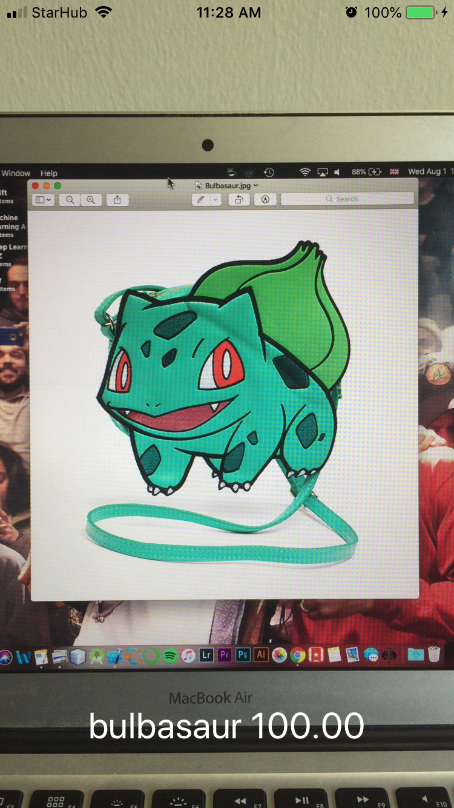
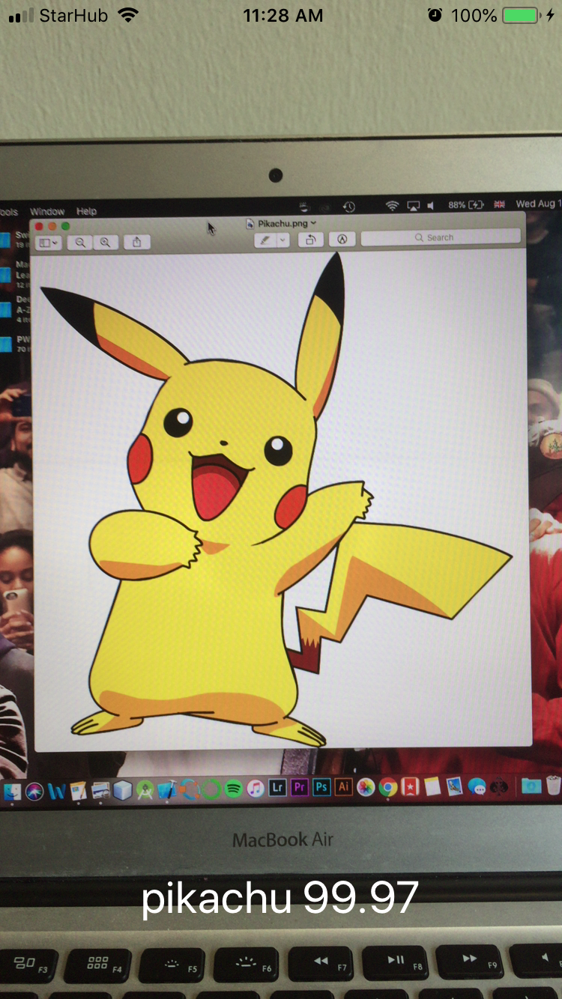
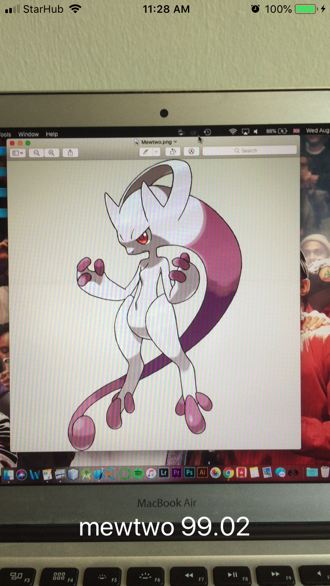
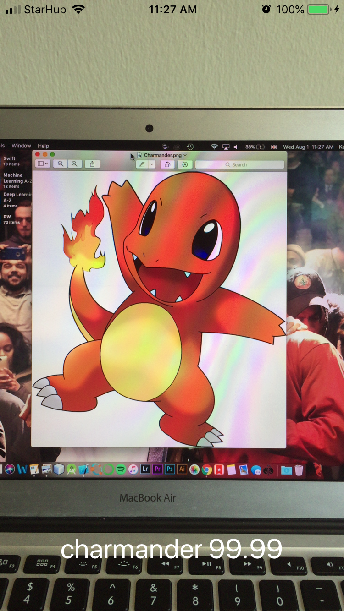

# Pokemon Classifier
A Keras-constructed model implemented as a real-time iOS Application that allows users to classify Pokemon detected through their camera feed as being one of five distinct Pokemon. Utilizes Tensorflow & Keras to train a network, and implements the Convolutional Neural Network using CoreML.

# Main File Descriptions and Workflow:
* search_bing_api.py: This file utilizes the Bing API to download and store images of the five Pokemon that will be used in training. The search was repeated five times, with each Pokemon being passed as a query on five separate occasions. All the resultant images are stored in the 'dataset' directory.
* train.py: This file utilizes the files in the dataset directory to construct a Keras model, utilizing the VGGNet, that can detect which Pokemon is in each image.
* classify.py: This file is used to test that the model created in the previous file works well. The images used to test this model are stored in the 'examples' directory, and can be passed as parser arguments.
* coremlconverter.py: This file converts the Keras model into a CoreML one for use on iOS applications.
* Pokedex: This directory holds the Swift project that implements the model as a real-time iOS application.

# Other File Descriptions:
* plot.png: This image is a visualization of the training results for the Keras model.
* pokedex.model: This stores the Keras-created classification model.
* pokedex.mlmodel: This holds the classification model as a CoreML model.

# Application Screenshots:

